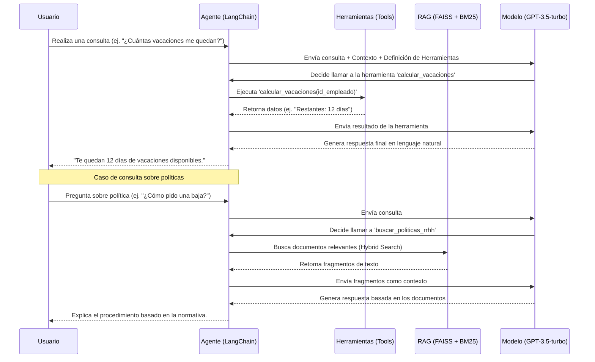

# Documentación del Proyecto: Asistente de RRHH

## 1. Uso del Procesamiento del Lenguaje Natural (PLN)

### ¿Cómo se utiliza el PLN en este proyecto?
Este proyecto utiliza técnicas avanzadas de PLN en dos áreas principales:

1.  **Comprensión y Generación de Lenguaje (LLM):** Se utiliza un LLM, específicamente **GPT-3.5-turbo**, para actuar como el cerebro del asistente. Este modelo, junto con LangChain, permite:
    *   Entender la intención del usuario expresada en lenguaje natural (en cualquier idioma).
    *   Mantener el contexto de la conversación (memoria).
    *   Decidir qué herramientas ejecutar basándose en la petición del usuario (Agentic Workflow).
    *   Generar respuestas coherentes, amables y contextualizadas.

2.  **Recuperación de Información (RAG - Retrieval Augmented Generation):** Se implementa un sistema RAG para permitir al asistente responder preguntas sobre políticas internas de la empresa (documentos estáticos).
    *   **Embeddings:** Se transforman los textos de las políticas en vectores numéricos utilizando el modelo `sentence-transformers/paraphrase-multilingual-MiniLM-L12-v2`. Esto permite capturar el significado semántico del texto.
    *   **Búsqueda Híbrida:** Se combina la búsqueda semántica (FAISS) con la búsqueda por palabras clave (BM25) para recuperar los fragmentos de texto más relevantes ante una consulta.

### ¿Por qué es útil utilizar PLN en este caso?
*   **Accesibilidad y Usabilidad:** Permite a los empleados interactuar con sistemas complejos (bases de datos de vacaciones, nóminas, normativas) utilizando su propio lenguaje, sin necesidad de aprender comandos o navegar por menús complicados.
*   **Eficiencia:** Automatiza respuestas a preguntas frecuentes (FAQs) sobre políticas, liberando al departamento de RRHH de tareas repetitivas.
*   **Disponibilidad 24/7:** El asistente está siempre disponible para resolver dudas o gestionar trámites básicos.
*   **Personalización:** El sistema reconoce al usuario y adapta las respuestas a su contexto (días de vacaciones restantes, historial de bajas, etc.).

---

## 2. Diagrama Conversacional

A continuación se presenta el flujo de interacción entre el usuario y el sistema:

---

## 3. Detalles Técnicos

### Modelo de Lenguaje (LLM)
*   **Modelo:** `openai/gpt-3.5-turbo`
*   **Proveedor:** OpenRouter
*   **Temperatura:** 0 (para maximizar la precisión y determinismo en el uso de herramientas)

### Framework y Librerías Principales
*   **LangChain (v0.3.0):** Framework principal para la orquestación del agente, gestión de herramientas y cadenas de procesamiento.
*   **Streamlit (v1.38.0):** Utilizado para crear la interfaz de usuario web interactiva.
*   **FAISS (Facebook AI Similarity Search):** Librería de búsqueda vectorial usada como motor de almacenamiento y recuperación eficiente de embeddings.
*   **Rank_BM25:** Algoritmo de recuperación basado en palabras clave para complementar la búsqueda semántica.

### Arquitectura RAG (Retrieval Augmented Generation)
*   **Embeddings:** `sentence-transformers/paraphrase-multilingual-MiniLM-L12-v2` (HuggingFace). Modelo multilingüe optimizado para similitud semántica.
*   **Estrategia de Recuperación:** `EnsembleRetriever` (Búsqueda Híbrida).
    *   50% peso para BM25 (coincidencia exacta de términos).
    *   50% peso para FAISS (similitud semántica).
    *   Recuperación de los top-3 documentos más relevantes (`k=3`).

### Herramientas Implementadas (Tools)
1.  `calcular_vacaciones`: Consulta el número de días de vacaciones restantes.
2.  `solicitar_vacaciones`: Registra nuevas solicitudes validando fechas y número de días disponibles.
3.  `consultar_solicitudes_vacaciones`: Historial de solicitudes.
4.  `reportar_baja_medica`: Crea reportes de baja validando solapamientos.
5.  `actualizar_baja_medica`: Modifica o finaliza bajas existentes.
6.  `consultar_bajas_medicas`: Historial de bajas.
7.  `consultar_nomina`: Recupera detalles de nóminas específicas o la última disponible.
8.  `buscar_politicas_rrhh`: Herramienta RAG para consultar el manual del empleado.

---

## 4. Enlaces

### Aplicación desplegada
https://asistente-rrhh.streamlit.app

### Vídeo con diferentes interacciones
https://youtu.be/TTs8O3gSTiQ

### Trazas de uso monitorizadas

